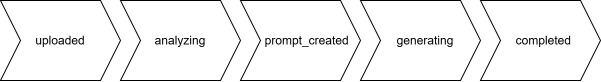

# 🚢 Docker-Compose

This repository only holds the docker-compose file [📄](compose.yaml) that builds the whole backend stack as defined here:


## 📂 Dependent Repositories

- 📂 `/middleware` : [`Backend-Interface`](https://github.com/Emotion2Emoji-LMU-ACP-WS24-25/Backend-Interface)
- 📂 `/imageGeneration` : [`Backend-StableDiffusion`](https://github.com/Emotion2Emoji-LMU-ACP-WS24-25/Backend-StableDiffusion)
- 📂 `/visionModel` : [`Backend-PaliGemma-2`](https://github.com/Emotion2Emoji-LMU-ACP-WS24-25/Backend-PaliGemma-2)
- 📂 `/llm` : [`Backend-Mistral`](https://github.com/Emotion2Emoji-LMU-ACP-WS24-25/Backend-Mistral)
- 📂 `/frontend` : [`Frontend-Flutter`](https://github.com/Emotion2Emoji-LMU-ACP-WS24-25/Frontend-Flutter)


## 🛠️ Job
Example:
```json
{
  "_id": {
    "$oid": "679f71d3f8e0140487a493d2"
  },
  "status": "completed",
  "frontImagePath": "uploads/livedemo/2025_02_02-13_23-front-751172597.jpg",
  "frontImageDescription": "A man with short gray hair and a full gray beard is wearing a blue shirt. The man is looking directly at the camera with his eyes closed. The man has a stern expression on his face. The man has a full beard and mustache. The man has a large forehead. The man has a large nose. The man has a large chin. The man has a large forehead. The man has a large forehead. The man has a large forehead. The man has a large forehead. The man has a large forehead. The man has a large forehead. The man has a large forehead. The man has a large forehead. The man has a large forehead. The man has a large forehead. The man has a large forehead. The man has",
  "backImagePath": "uploads/livedemo/2025_02_02-13_23-back-751172597.JPG",
  "backImageDescription": "A top-down view of a pizza that is sitting on a white surface. The pizza has a crust that is light brown, and along the top portion of the crust there are small black circles. The inside of the pizza is white, and along the white there are thin black lines that run horizontally. The inside of the pizza is being lit up by white light, and along the top portion of the pizza there are three leaves that are green. The pizza is being lit up by white light, and along the top portion of the pizza there are small black circles that run horizontally.",
  "prompt": "A middle-aged man with short gray hair and a full gray beard, closed green eyes, joyfully expressing happiness, wearing a blue shirt, in a setting with a top-down view of a well-lit, partially-eaten pizza on a white surface, adorned with small black-olive circles and three green leaves along its crust., icon emoji",
  "resultImagePath": "/app/emojis/679f71d3f8e0140487a493d2.png",
  "caption": "\"Blind Bite into Happiness\"",
  "emotion": "happy",
  "uploadDate": "2025-02-02",
  "uploadTime": "13:23:31",
  "__v": 0
}
```

### ✅ Job Status


## ⚙️ Setup & Build

To get the whole project with the correct folder structure use `git clone --recurse-submodules git@github.com:Emotion2Emoji-LMU-ACP-WS24-25/Docker-Compose.git [path]` with `path` being the optional custom path to clone the repo into.

`docker-compose up --build` : Brings up the whole stack including a persistent MongoDB Container, the "Middleware" (i.e. [`Backend-Interface`](https://github.com/Emotion2Emoji-LMU-ACP-WS24-25/Backend-Interface)) as well as the dependent VLM, LLM and Stable Diffusion (i.e. [`Backend-StableDiffusion`](https://github.com/Emotion2Emoji-LMU-ACP-WS24-25/Backend-StableDiffusion)) applications.

Use `-d` to run the docker-compose detached.

Expose backend port 3000 using ngrok with a static URL, following the instructions [here](https://dashboard.ngrok.com/get-started/setup/docker). Once set up, add the static URL to the .env file in the Flutter frontend. (See frontend README)

In the main directory, add a `.env` file as well.
1. **MODELS_PATH=VALUE**, the local path to the directory with all the downloaded model files
2. **API_KEY=VALUE**, the huggingface API key

For model download, use:
```
git lfs install
git clone git@hf.co:<MODEL ID> # example: git clone git@hf.co:google/paligemma2-3b-ft-docci-448
```